# Admin Guide - CyArt Security Suite

## Welcome, Administrator!

This guide explains your **full administrative privileges** and how to manage the CyArt Security Suite.

---

## 🔑 What You CAN Access (Full Privileges)

### ✅ Complete Access

| Feature | Access Level | Description |
|---------|-------------|-------------|
| **All Devices** | ✅ Full Access | View, manage, and quarantine ANY device |
| **All Logs** | ✅ Full Access | View logs from ALL devices system-wide |
| **All Alerts** | ✅ Full Access | View and resolve ALL alerts |
| **USB Whitelist** | ✅ Full Management | Approve/reject requests, manage whitelist |
| **Software Approval** | ✅ Full Management | Approve/reject requests, manage approved list |
| **Device Quarantine** | ✅ Full Control | Isolate and release devices |
| **User Management** | ✅ Full Control | Manage user accounts and permissions |
| **System Settings** | ✅ Full Control | Configure system-wide settings |
| **Device Assignment** | ✅ Full Control | Assign devices to users |
| **Policy Management** | ✅ Full Control | Set USB/software policies |

---

## 📋 Admin-Only Workflows

### 1. Admin Sign Up & Login

#### Creating Admin Account

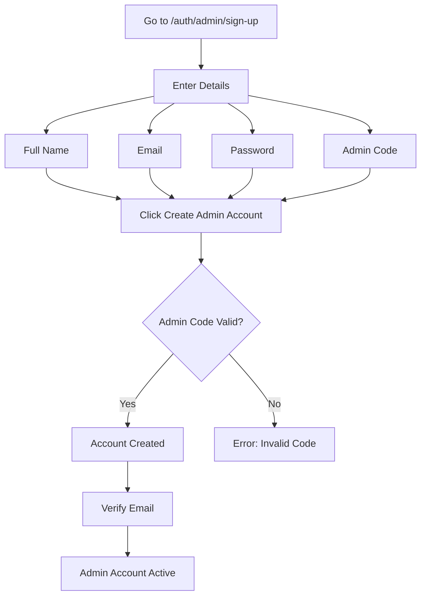

**Steps:**
1. Navigate to `https://your-domain.com/auth/admin/sign-up`
2. Fill in the form:
   - **Full Name**: Your name
   - **Email**: Your admin email
   - **Password**: Strong password (8+ characters)
   - **Admin Code**: Secret code (get from system administrator)
3. Click **"Create Admin Account"**
4. Verify your email
5. Login at `/auth/admin/login`

**Important:** Admin code is required for security. Contact system owner for the code.

#### Admin Login

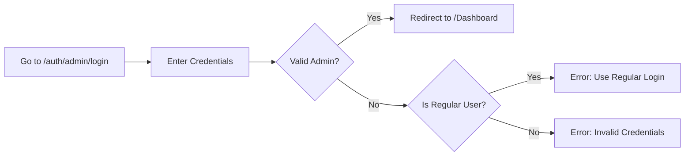

**Steps:**
1. Go to `https://your-domain.com/auth/admin/login`
2. Enter admin email and password
3. Click **"Sign In"**
4. Redirected to Admin Dashboard

**Note:** Regular users cannot login here - they must use `/auth/login`

---

### 2. Managing All Devices

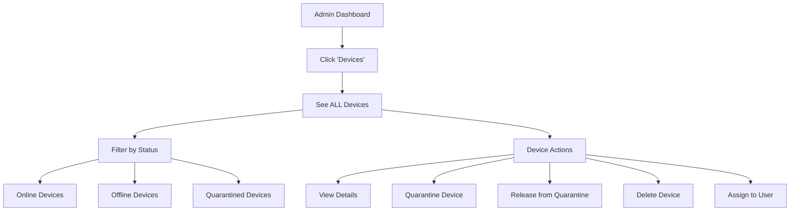

**Steps:**
1. Click **"Devices"** in sidebar
2. See **ALL devices** in the system (not just yours)
3. **Filter devices:**
   - By status: Online, Offline, Quarantined
   - By owner: See who owns each device
   - By type: Server, Agent, etc.
4. **Device actions:**
   - Click device to view full details
   - Click "Quarantine" to isolate device
   - Click "Release" to remove quarantine
   - Click "Delete" to remove from system
   - Edit device to assign to user

---

### 3. Quarantining Devices

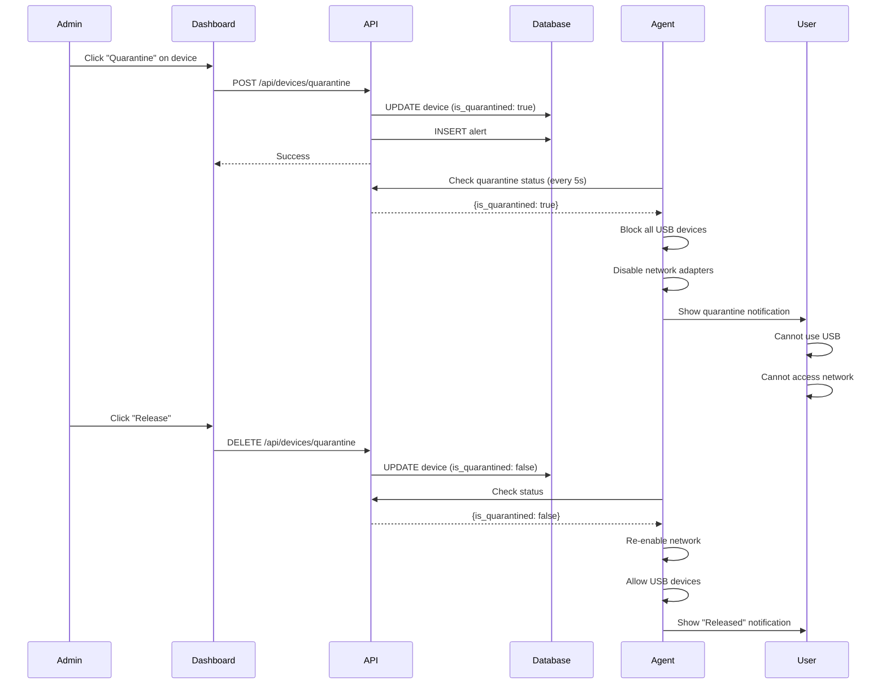

**Steps to Quarantine:**
1. Go to **Devices** page
2. Find the device to quarantine
3. Click **"Quarantine"** button
4. Confirm action
5. Device is immediately isolated:
   - All USB devices blocked
   - Network adapters disabled
   - User sees notification

**Steps to Release:**
1. Go to **Devices** page
2. Find quarantined device
3. Click **"Release"** button
4. Confirm action
5. Device returns to normal operation

**When to Quarantine:**
- Suspected malware infection
- Policy violations
- Security incidents
- Unauthorized access attempts
- Pending investigation

---

### 4. Approving USB Devices

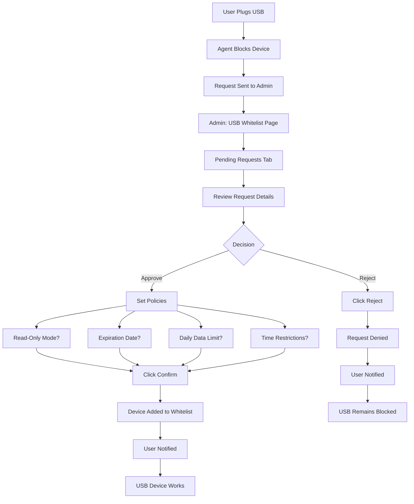

**Steps to Approve:**
1. Go to **USB Whitelist** page
2. Click **"Pending Requests"** tab
3. Review request details:
   - Device name and serial number
   - Vendor ID / Product ID
   - Requesting user and machine
   - Request timestamp
4. Click **"Approve"** button
5. **Configure policies:**
   - **Read-Only Mode**: ☑️ Prevent data exfiltration (recommended for external USBs)
   - **Expiration Date**: Set auto-revoke date (e.g., 30 days)
   - **Daily Data Limit**: Max MB transferred per day (e.g., 1000 MB)
   - **Time Restrictions**: Allow only during work hours (e.g., 09:00-17:00)
6. Click **"Confirm"**
7. Device is added to whitelist
8. User is notified

**Steps to Reject:**
1. Review request
2. Click **"Reject"** button
3. Confirm rejection
4. User is notified

**Policy Recommendations:**
- **External USBs**: Read-only + expiration date
- **Company USBs**: Full access, no expiration
- **Contractor USBs**: Time restrictions + expiration
- **Sensitive data**: Low daily limit + read-only

---

### 5. Managing USB Whitelist

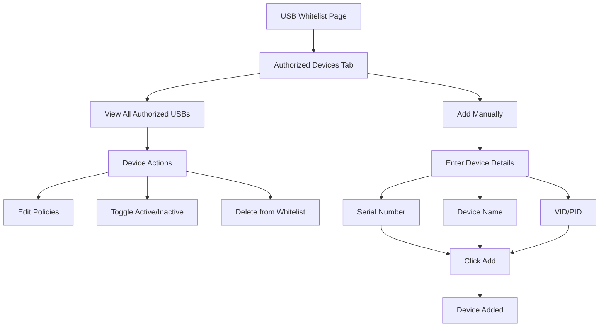

**Manual Addition:**
1. Click **"Add Manually"** button
2. Enter device information:
   - **Serial Number** (required): Get from device properties
   - **Device Name** (required): E.g., "SanDisk USB 3.0"
   - **Vendor ID** (optional): E.g., "0781"
   - **Product ID** (optional): E.g., "5583"
   - **Vendor Name** (optional): E.g., "SanDisk"
3. Click **"Add to Whitelist"**
4. Device is immediately authorized

**Editing Policies:**
1. Find device in list
2. Click **"Edit"** (pencil icon)
3. Modify policies:
   - Read-only mode
   - Expiration date
   - Data limits
   - Time restrictions
4. Click **"Save"**
5. Changes apply immediately

**Disabling Device:**
1. Click shield icon to disable
2. Device stays in whitelist but is blocked
3. Click again to re-enable

**Deleting Device:**
1. Click trash icon
2. Confirm deletion
3. Device removed from whitelist
4. Will be blocked on next connection

---

### 6. Approving Software

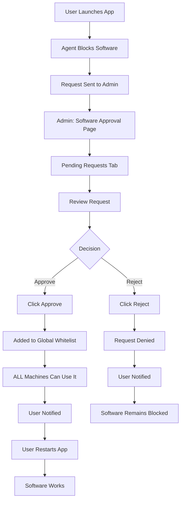

**Steps to Approve:**
1. Go to **Software Approval Center**
2. Click **"Pending Requests"** tab
3. Review request:
   - Software name
   - Publisher
   - Release year
   - Requesting user and machine
4. Click **"Approve"** button
5. Software added to **global whitelist**
6. **All machines** can now run it
7. User notified to restart application

**Steps to Reject:**
1. Review request
2. Click **"Reject"** button
3. Confirm rejection
4. User notified

**Approval Guidelines:**
- ✅ Approve: Business software, productivity tools, approved vendors
- ❌ Reject: Unknown publishers, suspicious software, personal apps
- ⚠️ Investigate: Unsigned software, old versions, rare publishers

---

### 7. Managing Software Whitelist

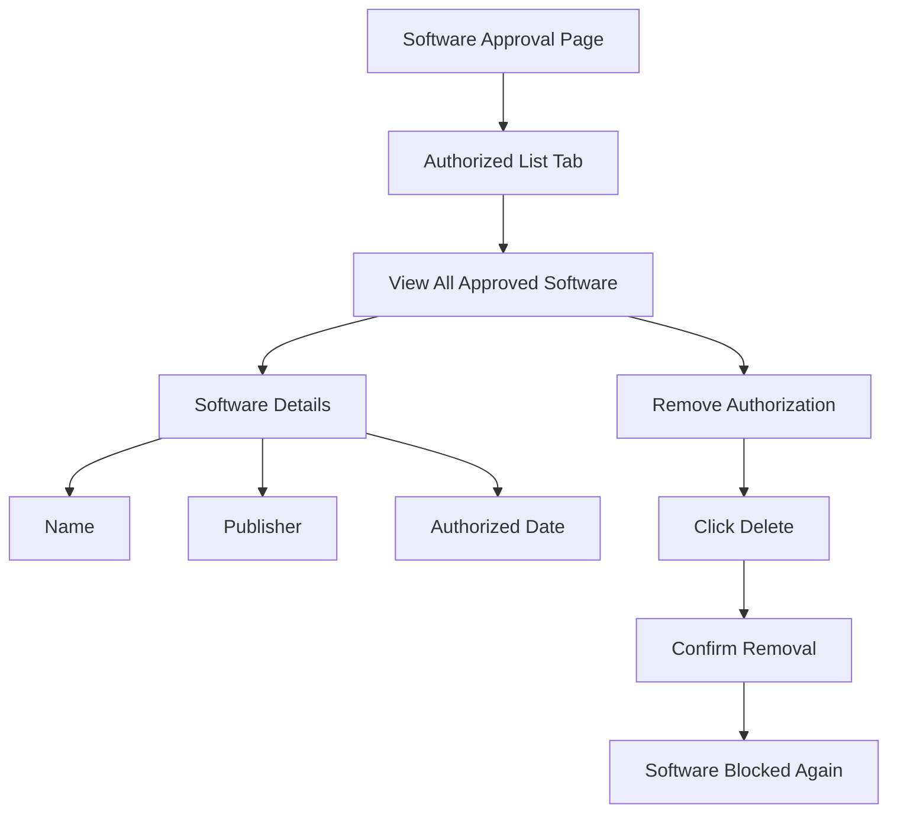

**Removing Software:**
1. Go to **"Authorized List"** tab
2. Find software to remove
3. Click **"Delete"** (trash icon)
4. Confirm removal
5. Software is blocked on all machines

**When to Remove:**
- Software no longer needed
- Security vulnerability discovered
- License expired
- Policy change

---

### 8. Viewing All Logs

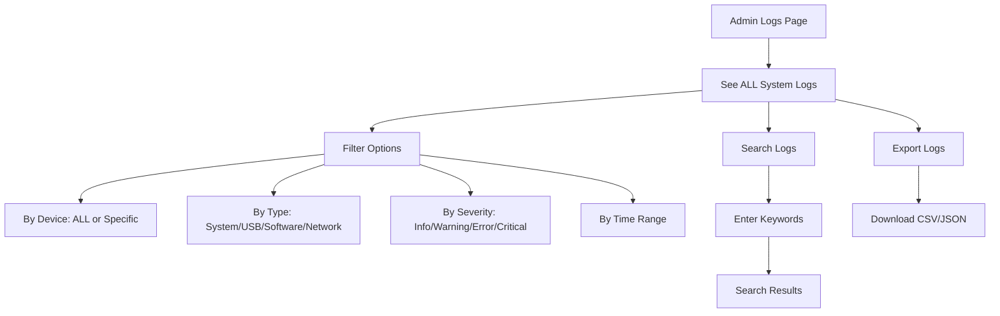

**Steps:**
1. Click **"Logs"** in sidebar
2. See **ALL logs** from **ALL devices**
3. **Advanced filtering:**
   - Select specific device or "All Devices"
   - Filter by log type
   - Filter by severity
   - Set time range (last hour, day, week, custom)
4. **Search:**
   - Enter keywords
   - Search across all fields
5. **Export:**
   - Click "Export" button
   - Choose format (CSV or JSON)
   - Download for analysis

**Log Types:**
- **System**: Agent status, registration, configuration
- **USB**: Device connections, approvals, blocks
- **Software**: Application launches, blocks, approvals
- **Network**: Topology discovery, connectivity
- **Security**: Quarantine, policy violations, alerts

---

### 9. Managing Alerts

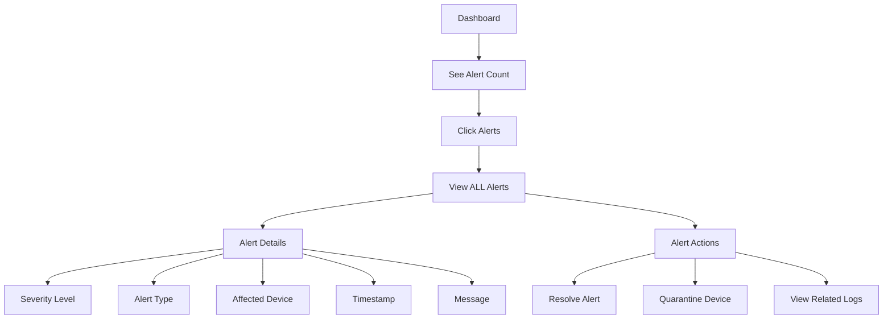

**Steps:**
1. Dashboard shows total alert count
2. Click **"Alerts"** in sidebar
3. See **ALL alerts** from **ALL devices**
4. **Review alert:**
   - Severity: Critical, High, Medium, Low
   - Type: USB, Software, Network, System
   - Device: Which machine triggered it
   - Details: What happened
5. **Take action:**
   - Click "Resolve" to dismiss alert
   - Click "Quarantine Device" for immediate isolation
   - Click "View Logs" to investigate

**Alert Response:**
- **Critical**: Immediate action required (quarantine, investigate)
- **High**: Review within 1 hour
- **Medium**: Review within 24 hours
- **Low**: Review when convenient

---

### 10. Assigning Devices to Users

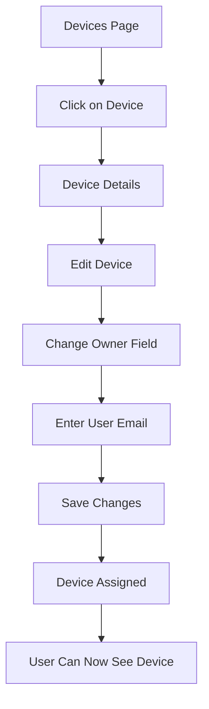

**Steps:**
1. Go to **Devices** page
2. Click on device to assign
3. Click **"Edit"** button
4. Change **"Owner"** field to user's email
5. Click **"Save"**
6. User can now see and monitor this device

**Best Practices:**
- Assign devices to users' work email
- One device can have one owner
- Owner sees device in their dashboard
- Owner sees device's logs and alerts

---

## 🎯 Admin Responsibilities

### Daily Tasks

1. **Review pending requests**
   - USB approval requests
   - Software approval requests
2. **Monitor alerts**
   - Respond to critical alerts immediately
   - Investigate high-priority alerts
3. **Check device status**
   - Ensure all devices are online
   - Investigate offline devices
4. **Review logs**
   - Look for suspicious activity
   - Monitor policy violations

### Weekly Tasks

1. **Review whitelist**
   - Remove expired USB devices
   - Update software approved list
2. **Audit user access**
   - Verify device assignments
   - Check user permissions
3. **Security review**
   - Review quarantine events
   - Analyze security trends

### Monthly Tasks

1. **Policy review**
   - Update USB policies
   - Adjust software approval criteria
2. **User management**
   - Add/remove users
   - Update user roles
3. **System maintenance**
   - Review system logs
   - Check for updates

---

## 🔒 Security Best Practices

### USB Approval

1. **Default to restrictive policies**
   - Use read-only mode for external USBs
   - Set expiration dates (30-90 days)
   - Limit data transfer (500-1000 MB/day)
2. **Verify device ownership**
   - Confirm device belongs to company
   - Check serial number against inventory
3. **Monitor usage**
   - Review USB logs regularly
   - Check for policy violations

### Software Approval

1. **Verify publisher**
   - Only approve known, trusted publishers
   - Check software signatures
2. **Version control**
   - Approve specific versions
   - Block outdated software
3. **Business justification**
   - Require reason for approval
   - Verify business need

### Device Quarantine

1. **Immediate quarantine for:**
   - Malware detection
   - Multiple policy violations
   - Suspicious network activity
2. **Investigation before release**
   - Review logs thoroughly
   - Verify threat is resolved
   - Scan device before release

### Access Control

1. **Principle of least privilege**
   - Users only see their devices
   - Admins have full access
2. **Regular audits**
   - Review user assignments
   - Check for unauthorized access
3. **Strong authentication**
   - Enforce strong passwords
   - Monitor login attempts

---

## 💡 Admin Tips

### Efficient Request Management

1. **Batch approvals**
   - Review all pending requests together
   - Apply consistent policies
2. **Communication**
   - Notify users of approval/rejection
   - Explain rejection reasons
3. **Documentation**
   - Keep notes on approval decisions
   - Document policy exceptions

### Troubleshooting

1. **Device offline**
   - Check if agent is running
   - Verify network connectivity
   - Check quarantine status
2. **USB not working after approval**
   - User needs to reconnect USB
   - Check if policies allow current time
   - Verify device is active (not disabled)
3. **Software still blocked**
   - User needs to restart application
   - Check if software name matches exactly
   - Verify approval was successful

---

## 📊 Admin Dashboard Overview

### Key Metrics

- **Total Devices**: All registered devices
- **Online Devices**: Currently active
- **Offline Devices**: Not reporting
- **Quarantined Devices**: Isolated for security
- **Pending USB Requests**: Awaiting approval
- **Pending Software Requests**: Awaiting approval
- **Active Alerts**: Unresolved alerts
- **Critical Alerts**: Require immediate attention

### Quick Actions

- Quarantine device
- Approve USB request
- Approve software request
- Resolve alert
- View logs
- Export data

---

## 🆘 Admin Troubleshooting

### Common Issues

**Issue**: "Can't quarantine device"
- **Cause**: Device offline
- **Solution**: Wait for device to come online, or force quarantine (will apply when device reconnects)

**Issue**: "USB approval not working"
- **Cause**: Agent not polling
- **Solution**: Restart agent on user's machine

**Issue**: "Too many pending requests"
- **Cause**: Delayed approval processing
- **Solution**: Set up approval workflows, delegate to sub-admins

**Issue**: "Logs not showing"
- **Cause**: Agent not sending logs or authentication failure
- **Solution**: Check agent connectivity, verify API URL, and **ensure Agent Key matches** server configuration.

---

## 📞 Admin Support

### System Configuration

- Environment variables setup
- Database configuration
- API endpoint configuration
- Agent deployment

### Advanced Features

- Custom policies
- Automated workflows
- Integration with other systems
- Reporting and analytics

---

## 🎯 Quick Reference

### Admin vs User Comparison

| Feature | Standard User | Admin |
|---------|--------------|-------|
| View own devices | ✅ | ✅ |
| View all devices | ❌ | ✅ |
| Quarantine devices | ❌ | ✅ |
| Approve USB | ❌ | ✅ |
| Approve software | ❌ | ✅ |
| View own logs | ✅ | ✅ |
| View all logs | ❌ | ✅ |
| Resolve alerts | ❌ | ✅ |
| Manage users | ❌ | ✅ |
| Configure policies | ❌ | ✅ |

**Remember:** With great power comes great responsibility. Use admin privileges wisely and always prioritize security.
