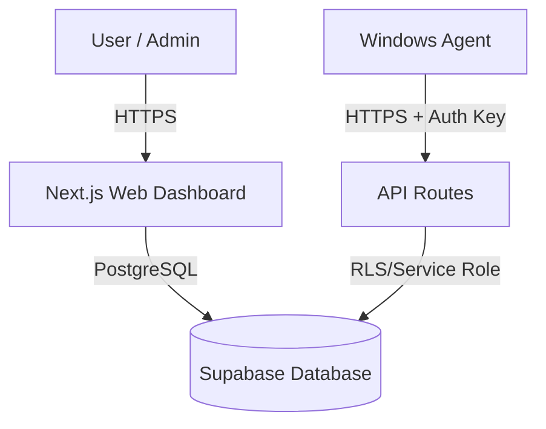

# System Architecture

## Overview

CyArt follows a client-server architecture designed for secure endpoint management.

## Components

### 1. Web Dashboard (Next.js)
- **Frontend**: React, Tailwind CSS, Shadcn UI.
- **Backend API**: Next.js App Router API Routes (`/app/api`).
- **Authentication**: Supabase Auth (User Management).
- **purpose**: Provides the UI for monitoring, policy management, and reporting.

### 2. Windows Agent (Go)
- **Service**: Runs as a Windows Service (`CyArtAgent`) with System privileges.
- **Capabilities**:
  - **USB Monitor**: Blocks unauthorized USBs, enforces read-only (Registry modification), tracks data usage.
  - **Network Monitor**: LLDP/SNMP discovery, active connection tracking, quarantine enforcement (Driver blocking).
  - **Software Audit**: Authenticode signature verification, proactive blocking of unverified EXE/MSI/DLLs.
- **Security**:
  - Communicates via HTTPS.
  - Authenticates using `X-Agent-Key`.
  - Fail-safe networking (auto-restore if disconnected).

### 3. Database (Supabase/PostgreSQL)
- Stores device inventory, logs, policies, and user data.
- **RLS (Row Level Security)**: Protects data so users only see their assigned devices.
- **Real-time**: Agents poll APIs; future updates may use Supabase Realtime.

## Security Model

### Agent Authentication
To prevent unauthorized devices from spamming the server or spoofing data, all Agent-to-Server communication is protected by a Shared Secret Key (`AGENT_SECRET_KEY`).
- **Server**: Validates `x-agent-key` header in middleware/API routes.
- **Agent**: Sends key with every request.

### Device Quarantine
In the event of a security breach, the Agent enforces quarantine locally:
1.  **Network**: Disables network adapters (except loopback) to isolate the threat.
2.  **USB**: Disables USB storage drivers (`USBSTOR`, `UASP`) to prevent data exfiltration.
3.  **UI**: Displays full-screen warning messages to the user.

### Least Privilege
- **Standard Users**: Can only view their own devices and request approvals.
- **Admins**: Have full system access.
- **Agent**: Requires local System privileges to enforce driver/registry policies but has limited API access (can only report data, not read sensitive user info).
