# CyArt Security Suite - Complete System Flow Documentation

## Table of Contents
1. [System Architecture](#system-architecture)
2. [Authentication Flows](#authentication-flows)
3. [Device Management Flows](#device-management-flows)
4. [USB Management Flows](#usb-management-flows)
5. [Software Management Flows](#software-management-flows)
6. [Monitoring & Logging Flows](#monitoring--logging-flows)

---

## System Architecture

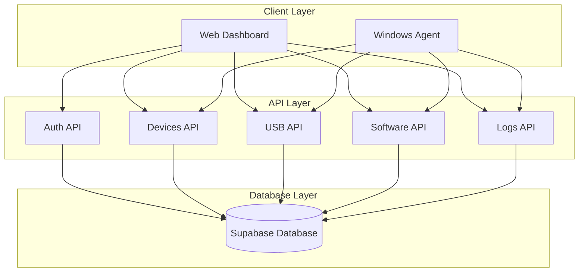

---

## Authentication Flows

### 1. User Signup Flow

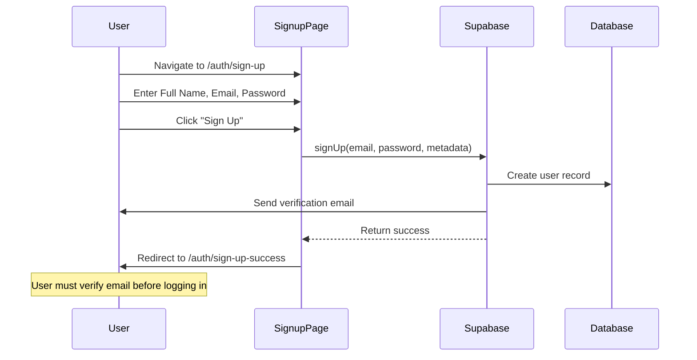

**Step-by-Step Guide:**

1. **Navigate to Signup Page**
   - Go to `/auth/sign-up`
   - See "Create Account" form

2. **Fill in Details**
   - Enter Full Name (e.g., "John Doe")
   - Enter Email (e.g., "john@example.com")
   - Enter Password (minimum 6 characters)
   - Click "Sign Up" button

3. **Email Verification**
   - Check your email inbox
   - Click verification link in email from Supabase
   - Account is now active

4. **Login**
   - Return to `/auth/login`
   - Use your credentials to sign in

---

### 2. User Login Flow

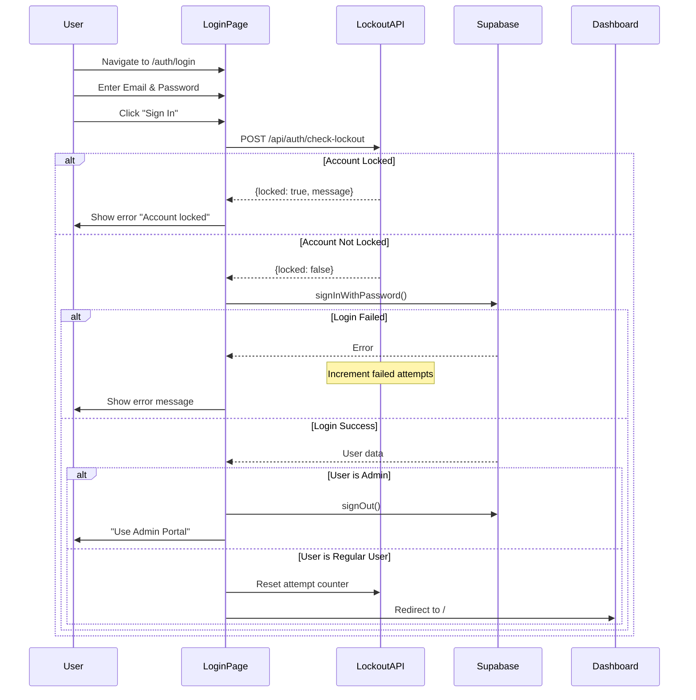

**Step-by-Step Guide:**

1. **Navigate to Login Page**
   - Go to `/auth/login`
   - See "Welcome Back" form

2. **Enter Credentials**
   - Enter your registered email
   - Enter your password
   - Click "Sign In"

3. **Account Lockout Protection**
   - System checks if account is locked (after 5 failed attempts)
   - If locked, wait 15 minutes or contact admin

4. **Successful Login**
   - Redirected to Dashboard (`/`)
   - Session created (24 hours)

5. **Admin Users**
   - If you're an admin, you'll be redirected to use `/auth/admin/login`

---

### 3. Admin Signup Flow

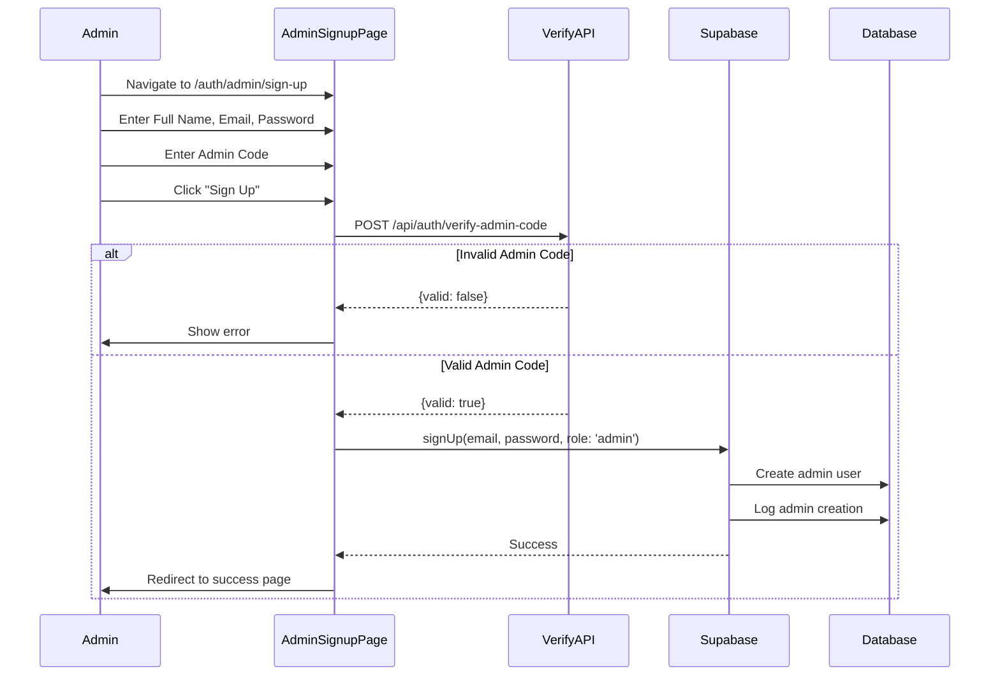

**Step-by-Step Guide:**

1. **Navigate to Admin Signup**
   - Go to `/auth/admin/sign-up`
   - See "Admin Registration" form

2. **Enter Admin Details**
   - Enter Full Name
   - Enter Email
   - Enter Password (minimum 6 characters)
   - **Enter Admin Code** (required - contact system administrator)

3. **Admin Code Verification**
   - System verifies admin code with `/api/auth/verify-admin-code`
   - If invalid, signup is rejected

4. **Account Creation**
   - Admin account created with `role: 'admin'` metadata
   - Event logged in system logs
   - Verification email sent

5. **Verify and Login**
   - Verify email
   - Login at `/auth/admin/login`

---

### 4. Admin Login Flow

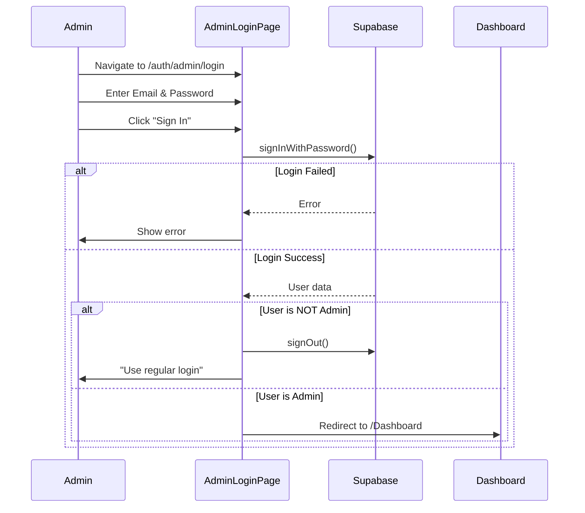

**Step-by-Step Guide:**

1. **Navigate to Admin Login**
   - Go to `/auth/admin/login`
   - See "Admin Portal" form

2. **Enter Admin Credentials**
   - Enter admin email
   - Enter password
   - Click "Sign In"

3. **Role Verification**
   - System checks `user_metadata.role === 'admin'`
   - Regular users are rejected

4. **Admin Dashboard Access**
   - Redirected to `/Dashboard`
   - Full admin privileges granted

---

## Device Management Flows

### 5. Device Registration (Agent)

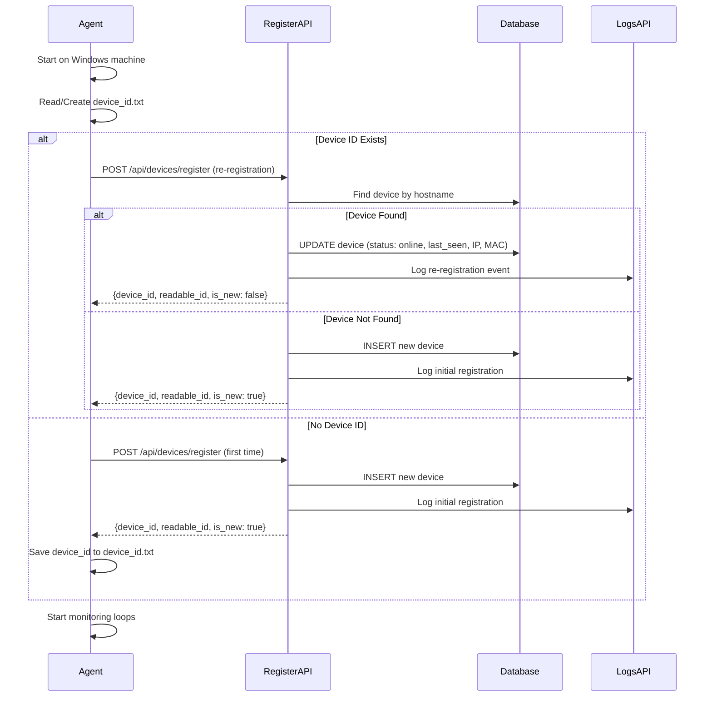

**Step-by-Step Guide:**

1. **Install Agent**
   - Download `CyArtAgent.exe`
   - Place in `C:\ProgramData\CyArtAgent\`

2. **Configure API URL**
   - Set environment variable: `CYART_API_URL=https://your-domain.com`
   - OR create `agent.config` with `{"server_url": "https://your-domain.com"}`

3. **Run Agent**
   - Execute `CyArtAgent.exe` (as Administrator recommended)
   - Agent collects system information:
     - Hostname
     - IP Address
     - MAC Address
     - OS Version

4. **Registration**
   - Agent sends POST to `/api/devices/register`
   - Server creates/updates device record
   - Agent receives `device_id` and saves locally

5. **Monitoring Begins**
   - Agent starts USB monitoring
   - Agent starts software monitoring
   - Agent sends heartbeat every 3 seconds

---

### 6. Device Quarantine Flow

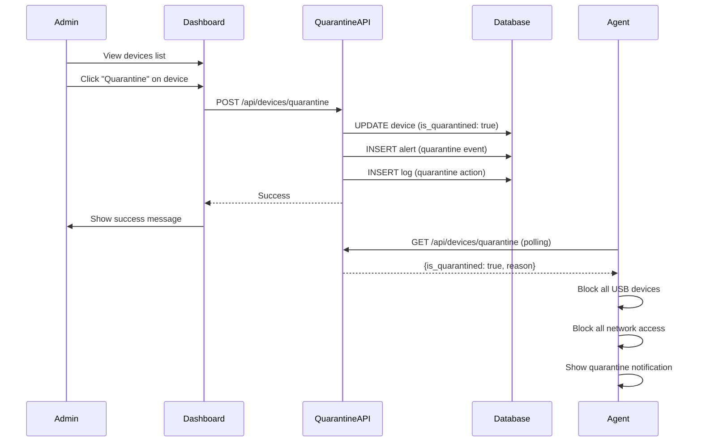

**Step-by-Step Guide (Admin):**

1. **Navigate to Devices**
   - Go to Dashboard
   - Click "Devices" in sidebar

2. **Select Device**
   - Find device to quarantine
   - Click "Quarantine" button

3. **Confirm Action**
   - Confirm quarantine in dialog
   - Device status changes to "Quarantined"

4. **Agent Response**
   - Agent detects quarantine status (within 5 seconds)
   - All USB devices blocked
   - Network access restricted
   - User sees notification

5. **Release from Quarantine**
   - Click "Release" button
   - Device returns to normal operation

---

## USB Management Flows

### 7. USB Device Connection & Approval Request

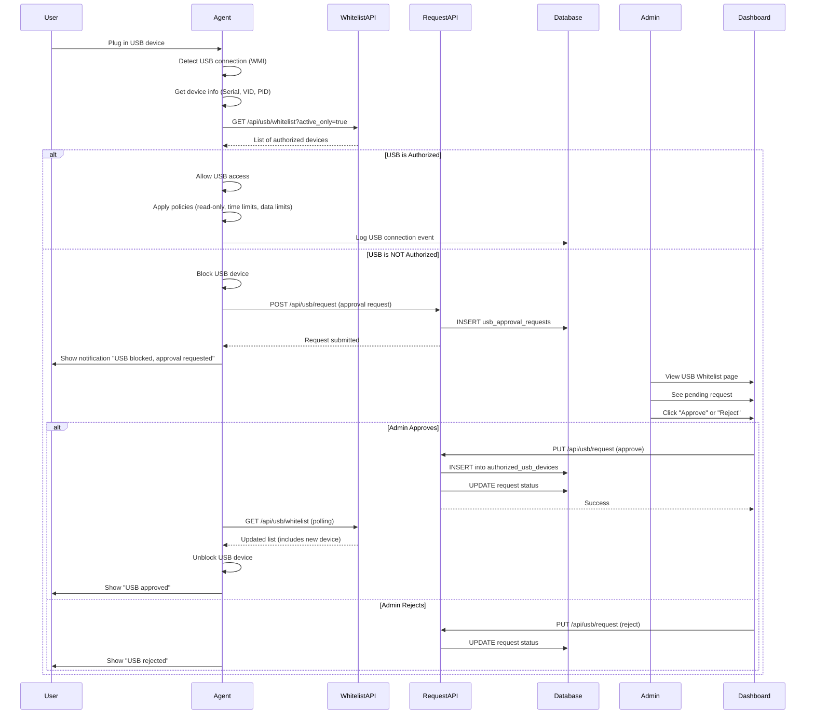

**Step-by-Step Guide (User):**

1. **Connect USB Device**
   - Plug USB device into computer
   - Agent detects connection immediately

2. **Automatic Check**
   - Agent checks if device is whitelisted
   - Compares serial number against authorized list

3. **If Authorized**
   - USB device works normally
   - Policies applied (read-only, time limits, etc.)

4. **If NOT Authorized**
   - USB device is blocked
   - Notification appears: "USB blocked - approval requested"
   - Request sent to admin automatically

5. **Wait for Approval**
   - Admin reviews request
   - You receive notification when approved/rejected

**Step-by-Step Guide (Admin):**

1. **View Pending Requests**
   - Go to "USB Whitelist" page
   - Click "Pending Requests" tab
   - See list of approval requests

2. **Review Request Details**
   - Device Name
   - Serial Number
   - Vendor ID / Product ID
   - Requesting Machine (hostname)
   - Request Time

3. **Approve with Policies**
   - Click "Approve" button
   - Configure policies:
     - **Read-Only Mode**: Prevent data exfiltration
     - **Expiration Date**: Auto-revoke after date
     - **Daily Data Limit**: Max MB transferred per day
     - **Time Restrictions**: Allow only during work hours
   - Click "Confirm"

4. **Reject Request**
   - Click "Reject" button
   - Request is denied
   - User is notified

---

### 8. USB Whitelist Management

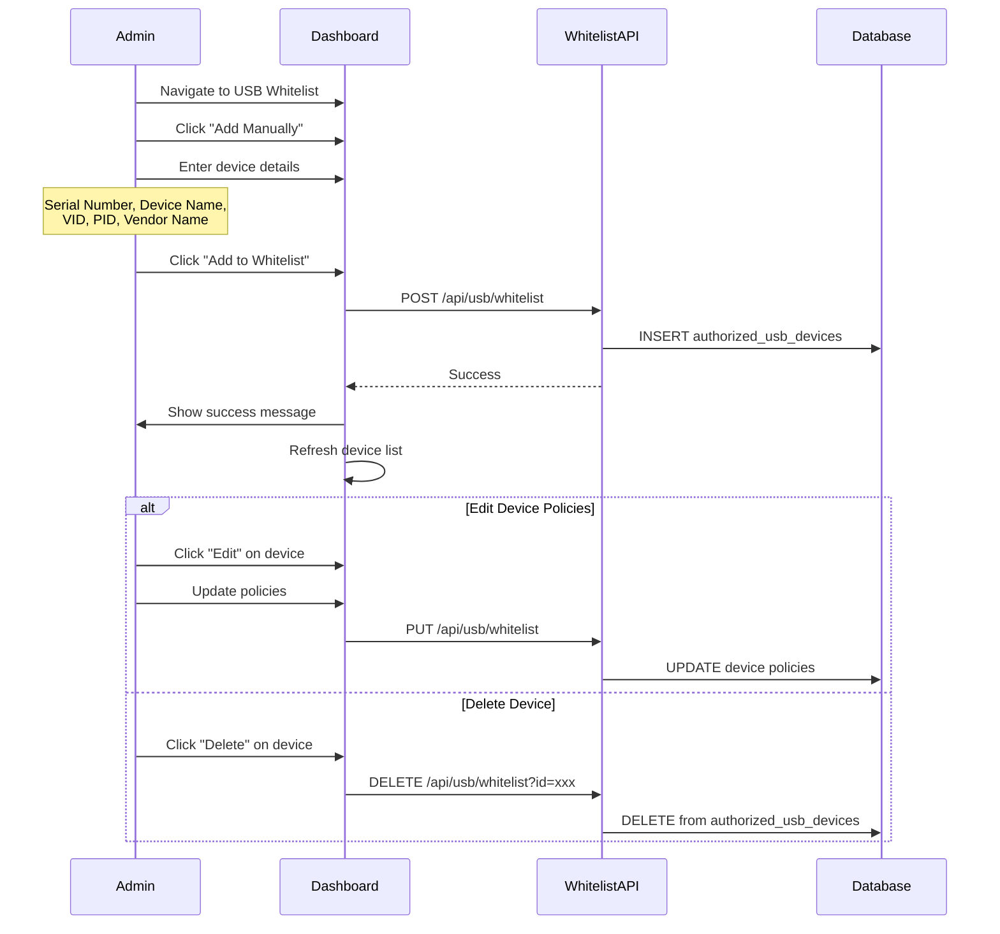

**Step-by-Step Guide:**

1. **Manual Addition**
   - Go to "USB Whitelist" → "Authorized Devices"
   - Click "Add Manually"
   - Enter:
     - Serial Number (required)
     - Device Name (required)
     - Vendor ID (optional)
     - Product ID (optional)
     - Vendor Name (optional)
   - Click "Add to Whitelist"

2. **Edit Policies**
   - Find device in list
   - Click "Edit" (pencil icon)
   - Modify policies:
     - Read-Only Mode
     - Expiration Date
     - Daily Data Limit
     - Time Restrictions
   - Click "Save"

3. **Toggle Active/Inactive**
   - Click shield icon to disable device
   - Device remains in whitelist but is blocked
   - Click again to re-enable

4. **Delete Device**
   - Click trash icon
   - Confirm deletion
   - Device removed from whitelist

---

## Software Management Flows

### 9. Software Detection & Approval Request

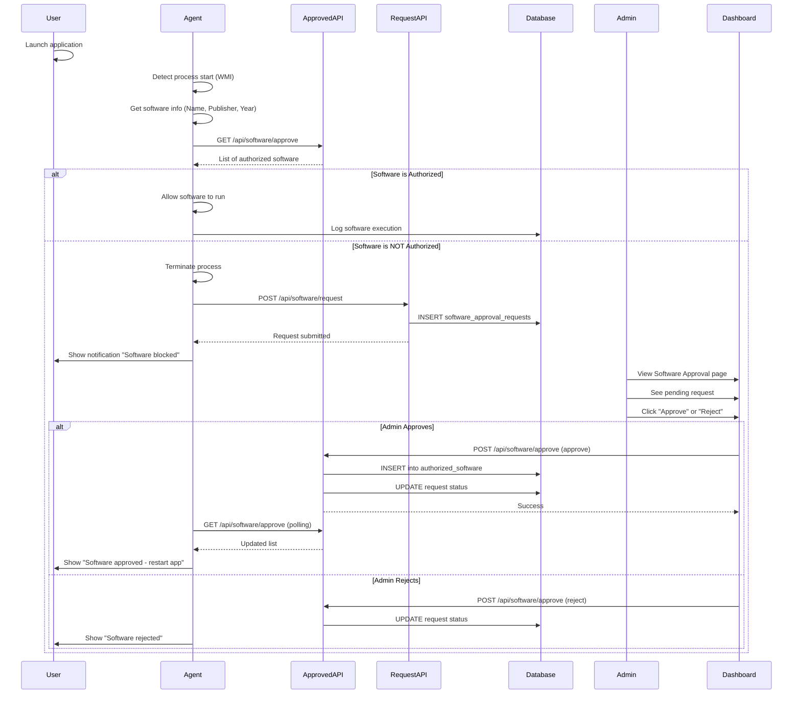

**Step-by-Step Guide (User):**

1. **Launch Application**
   - Double-click application
   - Agent detects process start

2. **Automatic Check**
   - Agent checks if software is authorized
   - Compares name/publisher against approved list

3. **If Authorized**
   - Application runs normally
   - Execution logged

4. **If NOT Authorized**
   - Application is terminated immediately
   - Notification: "Software blocked - approval requested"
   - Request sent to admin

5. **After Approval**
   - Receive notification
   - Restart application
   - Now runs normally

**Step-by-Step Guide (Admin):**

1. **View Pending Requests**
   - Go to "Software Approval Center"
   - Click "Pending Requests" tab

2. **Review Request**
   - Software Name
   - Publisher
   - Release Year
   - Requesting Machine

3. **Approve**
   - Click "Approve" button
   - Software added to global whitelist
   - All machines can now run it

4. **Reject**
   - Click "Reject" button
   - Software remains blocked

---

## Monitoring & Logging Flows

### 10. Real-Time Log Streaming

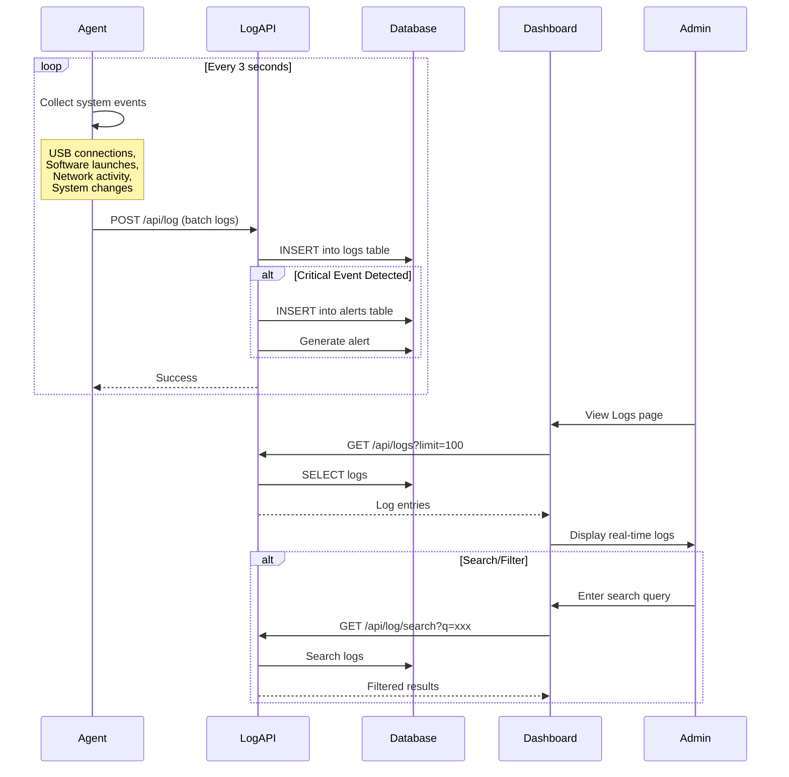

**Step-by-Step Guide:**

1. **View All Logs**
   - Go to "Logs" page
   - See real-time log stream
   - Auto-refreshes every 5 seconds

2. **Filter by Type**
   - Click filter dropdown
   - Select: System, USB, Software, Network, etc.

3. **Search Logs**
   - Enter search query
   - Search by: device name, message, event type

4. **View Log Details**
   - Click on log entry
   - See full details:
     - Timestamp
     - Device
     - Event type
     - Severity
     - Raw data (JSON)

5. **Export Logs**
   - Click "Export" button
   - Download as CSV or JSON

---

### 11. Alert Generation & Management

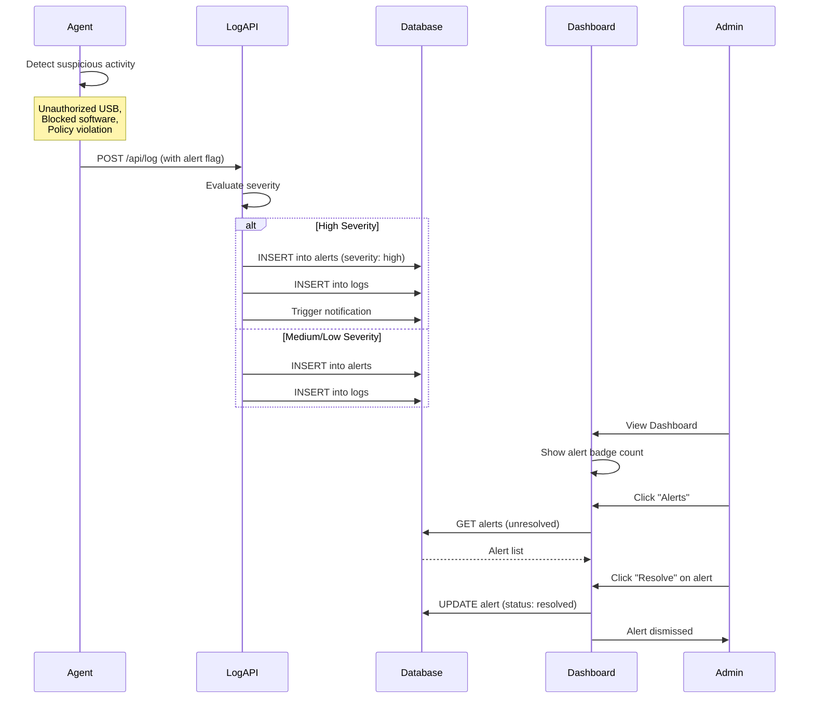

**Step-by-Step Guide:**

1. **View Alerts**
   - Dashboard shows alert count badge
   - Click "Alerts" in sidebar

2. **Alert Details**
   - Severity: Critical, High, Medium, Low
   - Type: USB, Software, Network, System
   - Device: Which machine triggered alert
   - Timestamp: When it occurred
   - Message: Description

3. **Resolve Alert**
   - Click "Resolve" button
   - Alert marked as resolved
   - Removed from active alerts

4. **Alert Actions**
   - **Quarantine Device**: Immediately isolate machine
   - **Block USB**: Add to blacklist
   - **View Logs**: See related log entries

---

## Quick Reference Tables

### User Roles & Permissions

| Feature | Regular User | Admin |
|---------|-------------|-------|
| View own devices | ✅ | ✅ |
| View all devices | ❌ | ✅ |
| Quarantine devices | ❌ | ✅ |
| Approve USB requests | ❌ | ✅ |
| Approve software requests | ❌ | ✅ |
| View all logs | ❌ | ✅ |
| Manage users | ❌ | ✅ |

### API Endpoints Summary

| Endpoint | Method | Purpose | Auth Required |
|----------|--------|---------|---------------|
| `/api/devices/register` | POST | Register/update device | No (agent) |
| `/api/devices/credentials` | GET | Get device credentials | Yes (admin/owner) |
| `/api/devices/quarantine` | POST/DELETE | Quarantine/release device | Yes (admin) |
| `/api/usb/whitelist` | GET/POST/PUT/DELETE | Manage USB whitelist | Yes (admin for write) |
| `/api/usb/request` | GET/PUT | USB approval requests | Yes (admin) |
| `/api/software/approve` | GET/POST/DELETE | Manage software whitelist | Yes (admin for write) |
| `/api/software/request` | GET | Software approval requests | Yes (admin) |
| `/api/logs` | GET | Retrieve logs | Yes |
| `/api/log` | POST | Submit logs | No (agent) |
| `/api/auth/check-lockout` | POST | Check account lockout | No |

### Agent Monitoring Intervals

| Activity | Interval |
|----------|----------|
| USB device polling | 3 seconds |
| Quarantine status check | 5 seconds |
| Software monitoring | Real-time (WMI events) |
| Heartbeat / status update | 3 seconds |
| Network topology scan | 30 seconds |
| Log batch submission | 3 seconds |

---

## Troubleshooting Common Flows

### "USB Device Not Working"

1. Check if device is whitelisted (Admin: USB Whitelist page)
2. Check if device is active (not disabled)
3. Check if policies allow current time/date
4. Check if data limit exceeded
5. Check agent logs for errors

### "Software Keeps Getting Blocked"

1. Check if software is in approved list (Admin: Software Approval)
2. Check pending requests tab
3. Approve software if legitimate
4. User must restart application after approval

### "Device Shows Offline"

1. Check if agent is running on machine
2. Check network connectivity
3. Check API URL configuration in agent
4. View agent logs for connection errors
5. Verify environment variables are set

---

## Summary

This documentation covers all major workflows in the CyArt Security Suite:

- ✅ **Authentication**: User/Admin signup and login
- ✅ **Device Management**: Registration, monitoring, quarantine
- ✅ **USB Control**: Whitelist management, approval workflow
- ✅ **Software Control**: Authorization, approval workflow
- ✅ **Monitoring**: Real-time logs, alerts, network topology

For technical implementation details, see:
- `ENVIRONMENT_VARIABLES.md` - Configuration guide
- `walkthrough.md` - Security fixes documentation
- API route files in `/app/api/` - Endpoint specifications
