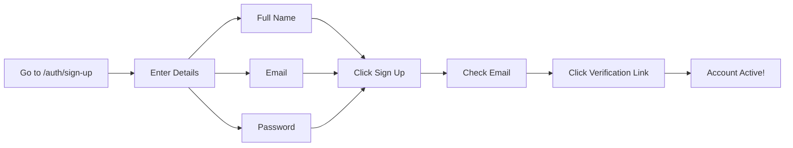
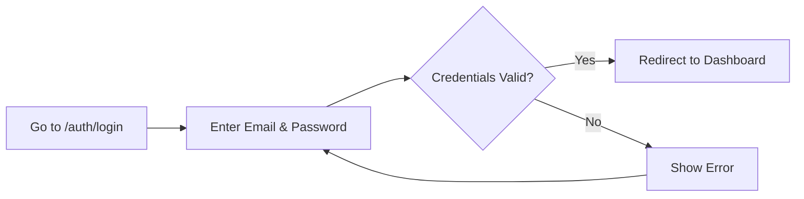
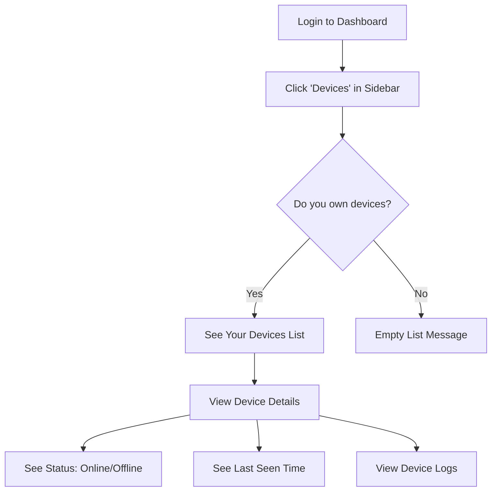
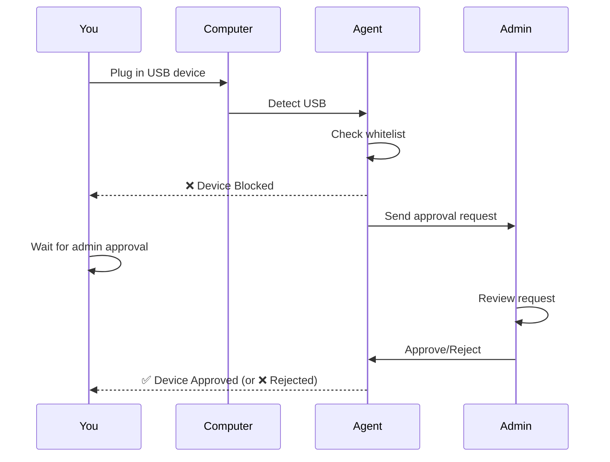
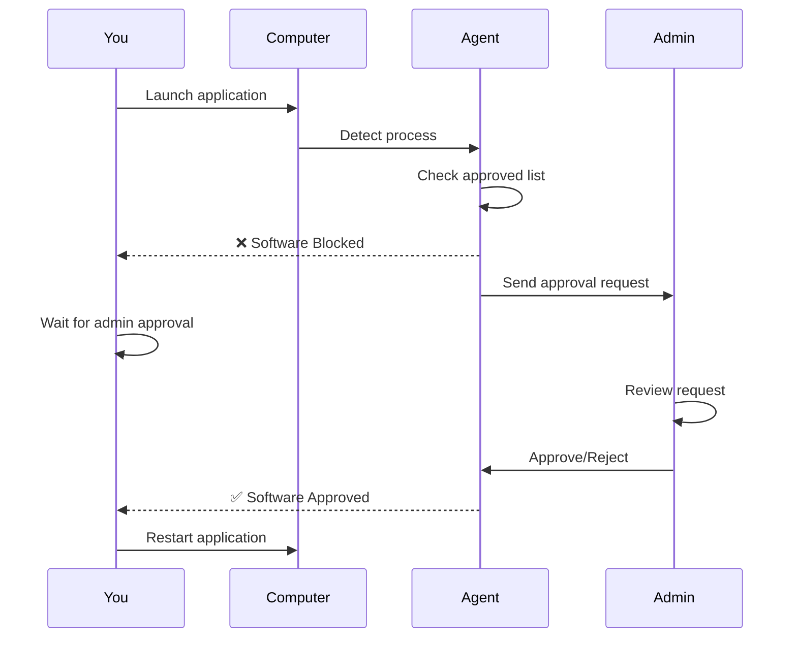
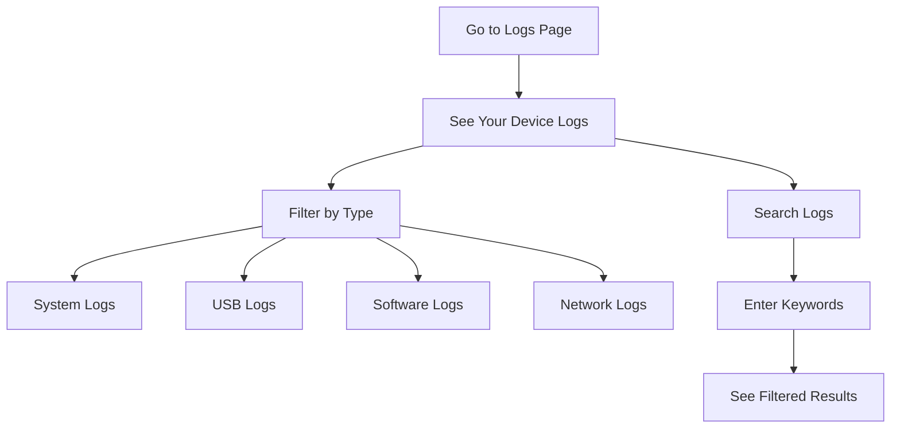
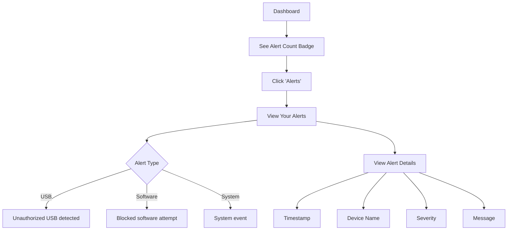

# Standard User Guide - CyArt Security Suite

## Welcome, User!

This guide explains everything you can do as a **Standard User** in the CyArt Security Suite.

---

## 🔐 What You CAN Access

### ✅ Available Features

| Feature | Access Level | Description |
|---------|-------------|-------------|
| **Dashboard** | ✅ View Own Data | See your devices, alerts, and activity |
| **Your Devices** | ✅ View Only | Monitor devices assigned to you |
| **Logs** | ✅ View Own Logs | See logs from your devices only |
| **Alerts** | ✅ View Own Alerts | View alerts related to your devices |
| **USB Requests** | ✅ Submit Requests | Request approval for USB devices |
| **Software Requests** | ✅ Submit Requests | Request approval for software |
| **Profile** | ✅ Full Access | Manage your account settings |

### ❌ Restricted Features

| Feature | Access Level | Why Restricted |
|---------|-------------|----------------|
| **All Devices** | ❌ No Access | Can only see your assigned devices |
| **USB Whitelist Management** | ❌ No Access | Admin-only feature |
| **Software Approval** | ❌ No Access | Admin-only feature |
| **Device Quarantine** | ❌ No Access | Admin-only security action |
| **User Management** | ❌ No Access | Admin-only feature |
| **System Settings** | ❌ No Access | Admin-only configuration |

---

## 📋 Step-by-Step User Workflows

### 1. Sign Up & Login

#### Creating Your Account

**Steps:**
1. Navigate to `https://your-domain.com/auth/sign-up`
2. Fill in the form:
   - **Full Name**: Your name
   - **Email**: Your work email
   - **Password**: At least 6 characters
3. Click **"Sign Up"**
4. Check your email inbox
5. Click the verification link
6. Return to login page

#### Logging In

**Steps:**
1. Go to `https://your-domain.com/auth/login`
2. Enter your email and password
3. Click **"Sign In"**
4. You'll be redirected to your dashboard

---

### 2. Viewing Your Devices

**Steps:**
1. Login to your account
2. Click **"Devices"** in the left sidebar
3. You'll see only devices assigned to you
4. Click on a device to see:
   - Device name and hostname
   - Online/Offline status
   - Last seen timestamp
   - IP address and MAC address
   - Recent activity logs

**What You See:**
- ✅ Devices where `owner` field matches your email
- ❌ Other users' devices (hidden from you)

---

### 3. Requesting USB Device Approval

**Steps:**
1. **Plug in USB device** to your computer
2. **Agent detects** the device automatically
3. If device is **not authorized**:
   - You'll see a notification: "USB blocked - approval requested"
   - Request is automatically sent to admin
4. **Wait for admin** to review
5. You'll receive notification when:
   - ✅ Approved: "USB device approved - you can use it now"
   - ❌ Rejected: "USB device rejected"

**What Happens:**
- Agent automatically creates approval request
- Admin sees request in USB Whitelist → Pending Requests
- Admin can approve with policies (read-only, time limits, etc.)
- Once approved, unplug and re-plug USB to use it

---

### 4. Requesting Software Approval

**Steps:**
1. **Launch an application** on your computer
2. **Agent detects** the software
3. If software is **not authorized**:
   - Application is immediately closed
   - Notification: "Software blocked - approval requested"
   - Request sent to admin automatically
4. **Wait for admin** to review
5. When approved:
   - You'll see: "Software approved - restart application"
6. **Restart the application** - it will now work

**Important:**
- You must restart the application after approval
- Agent checks software on every launch
- Once approved, software works on all machines

---

### 5. Viewing Your Logs

**Steps:**
1. Click **"Logs"** in sidebar
2. You'll see logs from **your devices only**
3. **Filter logs:**
   - By type: System, USB, Software, Network
   - By device: Select specific device
   - By severity: Info, Warning, Error, Critical
4. **Search logs:**
   - Enter keywords in search box
   - Search by device name, message, event type
5. **View log details:**
   - Click on any log entry
   - See full details including timestamp, device, raw data

**What You See:**
- ✅ Logs from devices you own
- ❌ Logs from other users' devices (hidden)

---

### 6. Viewing Your Alerts

**Steps:**
1. **Dashboard** shows alert count badge
2. Click **"Alerts"** in sidebar
3. See alerts from **your devices only**
4. **Alert information:**
   - Severity: Critical, High, Medium, Low
   - Type: USB, Software, Network, System
   - Device: Which of your machines
   - Timestamp: When it occurred
   - Message: What happened

**Note:** You can view alerts but **cannot resolve them** (admin-only action)

---

## 🚫 What You CANNOT Do

### Admin-Only Actions

1. **❌ Approve USB Devices**
   - You can only request approval
   - Admin must approve/reject

2. **❌ Approve Software**
   - You can only request approval
   - Admin must approve/reject

3. **❌ Quarantine Devices**
   - Cannot isolate devices
   - Admin-only security action

4. **❌ Manage Other Users**
   - Cannot see other users' devices
   - Cannot see other users' logs
   - Cannot modify other users' settings

5. **❌ Modify Whitelists**
   - Cannot add/remove USB devices from whitelist
   - Cannot add/remove software from approved list
   - Cannot edit policies (read-only, time limits, etc.)

6. **❌ Delete Devices**
   - Cannot remove devices from system
   - Admin-only action

7. **❌ View All Logs**
   - Can only see logs from your own devices
   - Cannot access system-wide logs

---

## 💡 Tips for Standard Users

### Getting USB Devices Approved Quickly

1. **Provide context** when requesting:
   - Tell admin why you need the USB device
   - Mention if it's for a specific project
2. **Use company-approved devices** when possible
3. **Plan ahead** - request approval before you need it

### Getting Software Approved

1. **Request business-critical software** first
2. **Provide justification** to admin
3. **Use approved alternatives** if available

### Monitoring Your Devices

1. **Check dashboard regularly** for alerts
2. **Review logs** if you notice unusual behavior
3. **Report issues** to admin if device shows offline unexpectedly

### Security Best Practices

1. **Don't share your login credentials**
2. **Use strong passwords** (at least 8 characters, mixed case, numbers, symbols)
3. **Log out** when leaving your workstation
4. **Report suspicious activity** to admin immediately
5. **Keep agent running** on your machines

---

## 🆘 Common Issues & Solutions

### "I can't see any devices"

**Cause:** No devices are assigned to your email

**Solution:**
- Contact admin to assign devices to you
- Ensure agent is running on your machines
- Check that device `owner` field matches your email

### "USB device won't work even after approval"

**Cause:** Need to reconnect USB device

**Solution:**
1. Unplug USB device
2. Wait 5 seconds
3. Plug it back in
4. Should work now

### "Software still blocked after approval"

**Cause:** Need to restart application

**Solution:**
1. Close the application completely
2. Wait a few seconds
3. Launch it again
4. Should work now

### "I forgot my password"

**Solution:**
- Contact your system administrator
- Admin can reset your password
- Or use password reset feature (if enabled)

### "Account locked after failed login attempts"

**Cause:** 5 failed login attempts

**Solution:**
- Wait 15 minutes for automatic unlock
- Or contact admin to unlock immediately

---

## 📞 Getting Help

### Contact Your Administrator

If you need help with:
- Device assignment
- USB/Software approval requests
- Account issues
- Technical problems

**How to reach admin:**
- Check your organization's IT support contact
- Email your admin directly
- Use internal helpdesk system

### Self-Service Resources

- **Dashboard**: Real-time status of your devices
- **Logs**: Detailed activity history
- **Alerts**: Important security notifications

---

## 🎯 Quick Reference

### User Capabilities Summary

| I want to... | Can I do it? | How? |
|--------------|--------------|------|
| View my devices | ✅ Yes | Dashboard → Devices |
| View all devices | ❌ No | Admin-only |
| Use a new USB device | ⚠️ Need Approval | Plug in → Wait for admin |
| Use new software | ⚠️ Need Approval | Launch → Wait for admin |
| See my logs | ✅ Yes | Logs page |
| See all logs | ❌ No | Admin-only |
| Quarantine a device | ❌ No | Admin-only |
| Approve USB requests | ❌ No | Admin-only |

---

## 🔄 Workflow Summary

### Daily Usage

1. **Login** to dashboard
2. **Check alerts** for any issues
3. **Monitor devices** status
4. **Request approvals** as needed
5. **Review logs** if investigating issues

### When You Need Something

1. **USB Device**: Plug in → Auto-request → Wait
2. **Software**: Launch → Auto-request → Wait → Restart app
3. **Help**: Contact admin

**Remember:** As a standard user, you have monitoring and request capabilities. All approval and management actions require admin privileges.
