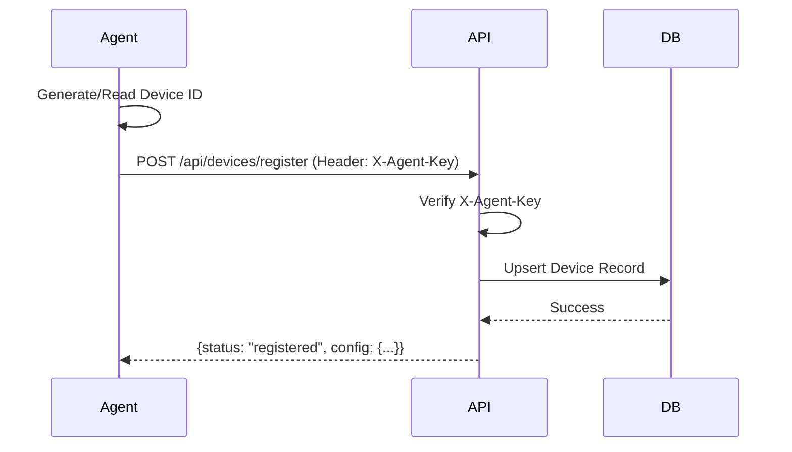

# CyArt Security Suite: Master Documentation (Consolidated)

**Version**: 10.0.0-COMPLETE
**Date**: January 2026
**Classification**: COMPLETE SYSTEM MANIFEST

---

## 📖 Table of Contents

1.  [Project Overview & Architecture](#1-project-overview--architecture)
2.  [Security Implementations](#2-security-implementations)
3.  [Deployment Guide](#3-deployment-guide)
4.  [Administration Guide](#4-administration-guide)
5.  [System Flows & Diagrams](#5-system-flows--diagrams)
6.  [Troubleshooting & Support](#6-troubleshooting--support)
7.  [Developer Reference & File Manifest](#7-developer-reference--file-manifest)
8.  [Standard User Guide](#8-standard-user-guide)
9.  [Appendix](#appendix)

---

# 1. Project Overview & Architecture

## 1.1 Executive Summary
CyArt is a comprehensive endpoint security management system designed for enterprise environments. It features a hybrid architecture with a globally accessible Next.js dashboard and a dedicated physical API server, managing a fleet of secure Windows Agents.

*   **Core Capabilities**:
    *   **Device Management**: Real-time health monitoring, hardware auditing, and remote quarantine.
    *   **USB Control**: Granular whitelisting (VID/PID/Serial), read-only policies, and blocking.
    *   **Software Auditing**: Application whitelisting, signature verification, and process termination.
    *   **Network Topology**: Layer 2/3 discovery (LLDP/SNMP) and visualization.
    *   **Security**: Authenticated agent communication, role-based access control (RBAC), and centralized logging.

## 1.2 System Architecture (Visual)


> **Note**: The diagram above shows the complete system architecture including:
> - **Cloud Layer**: Next.js Dashboard + Supabase Database
> - **On-Premise Layer**: Physical Node.js API Server
> - **Multi-Platform Endpoints**: 
>   - Windows Agents (Desktop PCs) - Go binary service
>   - Linux Agents (Servers/Workstations) - Bash script service
>   - macOS Agents (MacBooks) - Bash script daemon
> - All agents perform: USB Blocking, Software Auditing, Network Quarantine, and Real-time Logging

### Components
1.  **Web Dashboard (Next.js Application)**
    *   **Tech Stack**: Next.js 14, React, Tailwind CSS, Shadcn UI.
    *   **Role**: Provides the user interface for monitoring, alerts, and policy configuration.
    *   **Auth**: Supabase Auth with Role-Based Access Control (Admin vs. Standard User).

2.  **Cross-Platform Agents (Windows, Linux, macOS)**
    *   **Tech Stack**: 
        *   **Windows**: Go binary (`CyArtAgent.exe`) running as a Windows Service.
        *   **Linux**: Bash script (`linux-agent.sh`) running as a systemd service.
        *   **macOS**: Bash script (`mac-agent.sh`) running as a LaunchDaemon.
    *   **Role**: Runs with elevated privileges on endpoints. Enforces USB blocking, network quarantine, and collects logs.
    *   **Security**: 
        *   **X-Agent-Key**: All API requests must include this secret header.
        *   **Fail-safe**: Auto-restores network connectivity if the server is unreachable.

3.  **Database (Supabase/PostgreSQL)**
    *   **Role**: Central reliable storage for inventory, logs, and policies.
    *   **Security**: Row Level Security (RLS) ensures users only access their assigned devices.

---

# 2. Security Implementations

## 2.1 Global API Hardening (CORS & Origins)
All API endpoints (`/api/*`) are hardened to prevent Cross-Origin Resource Sharing (CORS) attacks and Cross-Site Request Forgery (CSRF).
*   **Strict Origin Validation**: The API validates the `Origin` header against the `NEXT_PUBLIC_APP_URL`.
*   **Standardized Headers**: Uses a unified `getCorsHeaders()` utility to ensure consistent security policies across `logs`, `alerts`, `devices`, and `software` endpoints.

## 2.2 Agent Authentication (Shared Secret)
To prevent unauthorized devices from spoofing data, a shared secret model is enforced.
*   **Mechanism**: A high-entropy `AGENT_SECRET_KEY` is generated on the server (`.env.local`).
*   **Enforcement**: 
    *   The Agent is compiled with this key.
    *   Every HTTP request from the Agent includes the `X-Agent-Key` header.
    *   The Server (`lib/api-utils.ts`) verifies this key before processing any data.
    *   **Fail-Secure**: Requests without the key are rejected with `401 Unauthorized`.

## 2.3 Role-Based Access Control (RBAC)
*   **Admin**: Full access. Can see all devices, approve/reject requests, and configure system-wide policies.
*   **Approver**: Can approve requests but has limited system configuration rights.
*   **User**: Can only view *their own* assigned devices and submit requests for USB/Software access.

---

# 3. Deployment Guide

## 3.1 Prerequisites
*   **Server**: Ubuntu 22.04 LTS (Physical or VPS), Node.js 18+, PM2.
*   **Database**: Supabase Project (Cloud or Local).
*   **Client Endpoints**: 
    *   Windows 10/11 (for Windows Agent)
    *   Linux (Ubuntu 20.04+, Debian, RHEL-based) (for Linux Agent)
    *   macOS 11+ (Big Sur or later) (for macOS Agent)

## 3.2 Server Setup (Physical/VPS)
1.  **Clone Repository**:
    ```bash
    git clone https://github.com/KshitijPatil08/CyArt-Project-.git /var/www/cyart
    cd /var/www/cyart
    npm install --legacy-peer-deps
    ```

2.  **Configure Secrets (`.env.local`)**:
    Create this file and ensure `AGENT_SECRET_KEY` is set to a strong random string.
    ```env
    NEXT_PUBLIC_SUPABASE_URL=https://your-project.supabase.co
    NEXT_PUBLIC_SUPABASE_ANON_KEY=eyJh...
    SUPABASE_SERVICE_ROLE_KEY=eyJh...
    ADMIN_SECRET_CODE=SecureAdminCode123!
    AGENT_SECRET_KEY=CriticalSecureKey2026!
    ALLOWED_ORIGINS=https://your-domain.com
    ```

3.  **Build & Launch**:
    ```bash
    npm run build
    pm2 start npm --name "cyart-backend" -- start
    pm2 save && pm2 startup
    ```

## 3.3 Agent Deployment

### 3.3.1 Windows Agent
1.  **Build the Agent**:
    On a Windows machine with Go installed:
    ```powershell
    cd scripts
    .\build-agent.ps1
    ```
2.  **Configure during Build**:
    The script will ask for:
    *   **Server URL**: `http://<your-server-ip>:3000` (or your domain).
    *   **Agent Key**: Must match the `AGENT_SECRET_KEY` from the server.
3.  **Deploy**:
    Copy `CyArtAgent.exe` and `install.bat` to the target machine and run `install.bat` as Administrator.

### 3.3.2 Linux Agent
1.  **Deploy the Script**:
    ```bash
    cd scripts
    chmod +x linux-agent.sh
    sudo ./linux-agent.sh "https://your-server.com" "$(hostname)" "user@example.com" "Office"
    ```
2.  **Install Dependencies**:
    ```bash
    sudo apt-get install -y jq snmp net-tools
    ```
3.  **Run as Service** (Optional):
    Create a systemd service to run the agent on boot.

### 3.3.3 macOS Agent
1.  **Deploy the Script**:
    ```bash
    cd scripts
    chmod +x mac-agent.sh
    sudo ./mac-agent.sh "https://your-server.com" "$(hostname)" "user@example.com" "Office"
    ```
2.  **Install Dependencies**:
    ```bash
    brew install jq net-snmp
    ```
3.  **Run as LaunchDaemon** (Optional):
    Create a plist file in `/Library/LaunchDaemons/` to run the agent on boot.

---

# 4. Administration Guide

## 4.1 USB Whitelisting Workflow
1.  **Block**: By default, unauthorized USB storage devices are blocked by the Agent.
2.  **Request**: The user sees a popup and requests access via the Agent UI.
3.  **Approve**:
    *   Admin logs in to Dashboard -> **USB Whitelist**.
    *   Locate the "Pending Request".
    *   Click **Approve** and set policies (e.g., Read-Only, Expire in 30 days).
4.  **Effect**: The Agent polls the whitelist, sees the new serial number, and unlocks the USB port.

## 4.2 Software Approval Workflow
1.  **Detection**: The Agent detects a new process execution.
2.  **Verification**: Checks the process signature/hash against the `Authorized Software` list.
3.  **Action**: 
    *   If unknown: **Process Terminated**. User notified.
    *   User requests approval.
4.  **Admin Action**: Admin approves the software (Vendor/Name) in the Dashboard.
5.  **Result**: The software is now trusted globally across the fleet.

## 4.3 Device Quarantine (Kill Switch)
In case of a breach (e.g., ransomware detection):
1.  Admin clicks **Quarantine** on the device in the Dashboard.
2.  Server updates status to `Quarantined`.
3.  Agent receives signal (within 5 seconds):
    *   **Network**: Disables all non-loopback network adapters.
    *   **USB**: Disables USB drivers.
    *   **User**: Shows "DEVICE QUARANTINED" lock screen.

---

# 5. System Flows & Diagrams

### Visual Authentication & RBAC Flow


## 5.2 Device Registration Flow


## 5.3 Workflows: USB & Software Control

### Visual USB Access Workflow


### Visual Software Security Workflow


### Visual Quarantine Workflow


---

# 6. Troubleshooting & Support

## 6.1 Agent Not Connected
*   **Symptom**: Device shows "Offline" in dashboard.
*   **Fix**:
    1.  Check internet connection on device.
    2.  Verify `CyArtAgent` service is running (`Get-Service CyArtAgent`).
    3.  **CRITICAL**: Ensure the Agent was built with the correct `AGENT_SECRET_KEY` matching the server's `.env.local`. If they mismatch, the server will reject all logs with `401 Unauthorized`.

## 6.2 Logs Not Appearing
*   **Symptom**: Device is online but logs list is empty.
*   **Check**:
    *   Browser Console: Check for CORS errors (should be fixed with Global Hardening).
    *   Server Logs: Check for "Invalid Agent Key" errors.

## 6.3 USB Still Blocked After Approval
*   **Cause**: Polymerization delay or mismatch in Serial Number.
*   **Fix**: 
    *   Ask user to unplug and replug the device.
    *   Check if "Read-Only" policy is conflicting with write attempts.

---

# 7. Developer Reference & File Manifest

## 7.1 Backend Structure (`/app`)
*   `app/auth/*` - Authentication pages (Sign In, Admin Login).
*   `app/api/devices/*` - Device management endpoints (Register, Quarantine, List).
*   `app/api/usb/*` - USB Whitelisting and Request/Approval management.
*   `app/api/software/*` - Software Execution Control policies.
*   `app/api/logs/*` - Centralized logging intake.
*   `middleware.ts` - Edge Middleware for Session validation and Rate Limiting.

## 7.2 Component Library (`/components`)
*   **Dashboards**:
    *   `SecurityDashboard.tsx`: Primary Admin interface (Alerts, Devices, Logs).
    *   `device-management.tsx`: Grid/Table view of all managed endpoints.
*   **Management Widgets**:
    *   `usb-whitelist-management.tsx`: Interface for approving/rejecting USBs and setting policies.
    *   `software-management.tsx`: Interface for global software allow-lists.
    *   `network-topology.tsx`: Visual graph of discovered network assets.
*   **User Interface**:
    *   `usb-request-dialog.tsx`: Popup for users to submit justification for USB access.
    *   `user/user-usb-requests.tsx`: Status tracker for a user's submitted requests.

## 7.3 Agent Scripts (`/scripts`)
*   **`windows-agent-production.go`**: The Windows Agent (Go). Contains logic for:
    *   WMI Hardware Scanning.
    *   USB Driver hooking (`USBSTOR`).
    *   Software process auditing.
    *   Network Quarantine (Netsh commands).
*   **`linux-agent.sh`**: The Linux Agent (Bash). Contains logic for:
    *   USB device tracking via `udevadm` and `lsblk`.
    *   Network discovery via SNMP.
    *   Software auditing (`.deb`, `.rpm`, `.AppImage` files).
    *   Network quarantine via `ip link`.
*   **`mac-agent.sh`**: The macOS Agent (Bash). Contains logic for:
    *   USB device tracking via `system_profiler` and `diskutil`.
    *   Network discovery via SNMP.
    *   Software auditing (`.dmg`, `.pkg`, `.app` files).
    *   Network quarantine via `networksetup`.
*   **`build-agent.ps1`**: PowerShell factory script. Compiles the Go agent and embeds the `Server URL` and `Agent Key`.
*   **`register-server.sh`**: Helper to register the backend server itself as a trusted node in the topology.
*   **`usb_request_gui.ps1`**: A lightweight PowerShell GUI deployed to Windows endpoints, allowing users to initiate a USB access request if blocked.

## 7.4 Security Utilities (`/lib`)
*   `lib/api-utils.ts`: Contains the critical security logic:
    *   `verifyAgentKey(req)`: Validates the `X-Agent-Key`.
    *   `getCorsHeaders(req)`: Enforces Strict Origin policies.
*   `lib/supabase/middleware.ts`: Handles Supabase Auth session refreshing.

---

# 8. Standard User Guide

## 8.1 Your Dashboard
Standard users have limited access. You can only see **devices assigned to you**.
*   **View Devices**: See the online status and health of your workstations.
*   **My Profile**: Manage your password and session.

## 8.2 Requesting Access
If a USB device or Software application is blocked by the CyArt Agent:
1.  **Notification**: You will see a Windows Toast Notification ("Action Blocked").
2.  **Request Popup**: Click the notification to open the Request Dialog.
3.  **Submit**: Enter a justification (e.g., "Need for Project X") and submit.
4.  **Wait**: The Admin receives your request instantly.
5.  **Approval**: Once approved, you will receive a notification.
    *   **USB**: Unplug and replug the device.
    *   **Software**: Restart the application.

## 8.3 Self-Service Troubleshooting
*   **"Device Offline"**: Check your internet connection. Ensure the "CyArt Agent" service is running in Task Manager.
*   **"Access Denied"**: If a previously approved device stops working, check if the approval expired (some approvals are temporary).

---

# Appendix

## Appendix A: Detailed System Diagrams
(Refer to Section 1.2 and 5.2 for Visual Diagrams)

## Appendix B: Environment Variables Reference
| Variable | Required? | Purpose |
|----------|-----------|---------|
| `NEXT_PUBLIC_APP_URL` | Yes | Validates CORS Origins. |
| `AGENT_SECRET_KEY` | **CRITICAL** | Authenticates Agents. |
| `ADMIN_SECRET_CODE` | Optional | Emergency Admin Access override. |
| `NEXT_PUBLIC_SUPABASE_URL` | Yes | DB Connection. |
| `NEXT_PUBLIC_SUPABASE_ANON_KEY` | Yes | Public API Key. |
| `SUPABASE_SERVICE_ROLE_KEY` | Yes | Admin API Key (Server-side only). |

